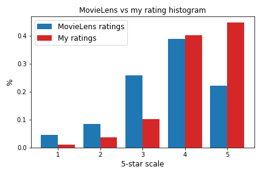
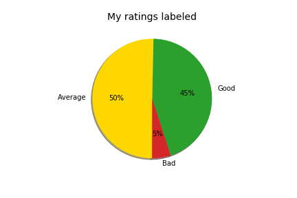
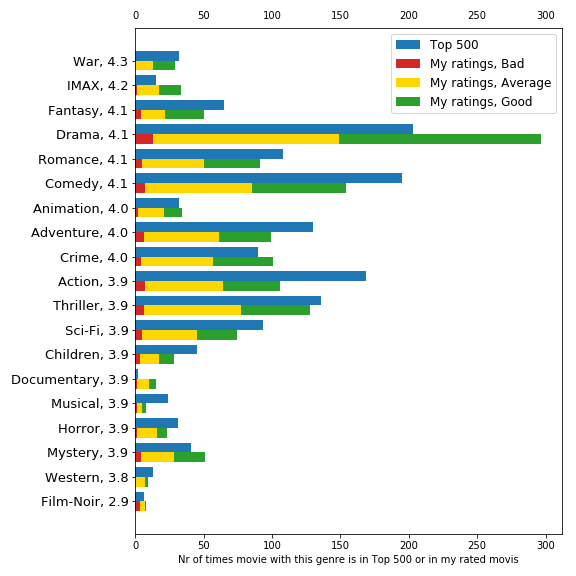
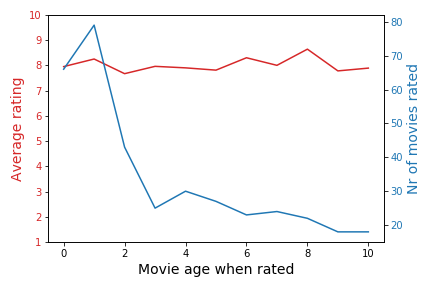

# MovieRec

##### Goal 
Personal movie recommendations system.

##### Hypothesis
My past movie ratings and MovieLens Datasets are an informative signal.  

##### Data
My IMDb [ratings](https://www.imdb.com/user/ur15834927/ratings) and
MovieLens 20m [dataset.](http://files.grouplens.org/datasets/movielens/ml-20m.zip) 
([readme](http://files.grouplens.org/datasets/movielens/ml-20m-README.html))  

##### Hypothesis test
[FastaAi's](https://docs.fast.ai/collab.html) collaborative filtering model.  

##### Success definition
Final test is with 100 randomly selected Never-Before-Seen movies 
that I have rated. The model is going predict the order of these movies from worst to best.  
In the top 10 of the most promising movies there should be:  
* 8+ good movies
* 0 bad movies

##### Terms
 Good movie - 9 stars or more out of 10. (my personal rating)  
 Average movie  
 Bad movie =< 4 stars  

##### Example
100 randomly sorted movies  
  

Ideal output from model
  

Only the last 10 (highly recommended) movies have to be correctly predicted.  
There is 2% change that randomly sorted movies are correctly predicted. (8+ good, 0 bad)

&nbsp;
## Data analysis

In between 2007 and 2015 I rated 497 movies in IMDb.  
(The first was 'The Shawshank Redemption' with maximum rating.)

MovieLens dataset contains 20000263 ratings across 27278 movies. These data were created by 138493 users between 1995 and 2015.
Users were selected at random and all of them had rated at least 20 movies.

To speed up the training I could use MovieLens ratings from the 2007-2015 period only.

#### Ratings

IMDb ratings are made on a 10-star scale (1 stars - 10 stars).
MovieLens ratings are made on a 5-star scale, with half-star increments (0.5 stars - 5.0 stars) but the half-star ratings are less frequently used.

To compare my ratings with MovieLens ratings I used 5-star scale, with one-star increments (1 stars - 5 stars)

#### Most popular movies
Not to be confused with best/highest rated movies.

1. Pulp Fiction (1994)
2. Forrest Gump (1994)
3. The Shawshank Redemption (1994)
4. The Silence of the Lambs (1991)
5. Jurassic Park (1993)

#### Genres
Plotting 500 most popular movie genres and genres from the movies that I have rated.

* Over half of the movies that I have rated are 'Drama'
* I have avoided 'Musicals'
* I don't like 'Film-Noir' (film marked by a mood of pessimism, fatalism, and menace). 
* I should watch more 'War' movies.

#### Movie Age
Do I prefer old movies or new?  
'Movie age' 0 means that I rated the movie the same year it was released.

* 1/3 movies are up to 2 years old
* There are no clear correlation between move age and average rating

&nbsp;
## Collaborative filtering
&nbsp;
...

### Code
Pyton [notebook](https://github.com/korjusk/MovieRec/blob/master/MovieRec.ipynb) in 
[nbviewer](https://nbviewer.jupyter.org/github/korjusk/MovieRec/blob/master/MovieRec.ipynb)

##### Authors
* Kaur Korjus
